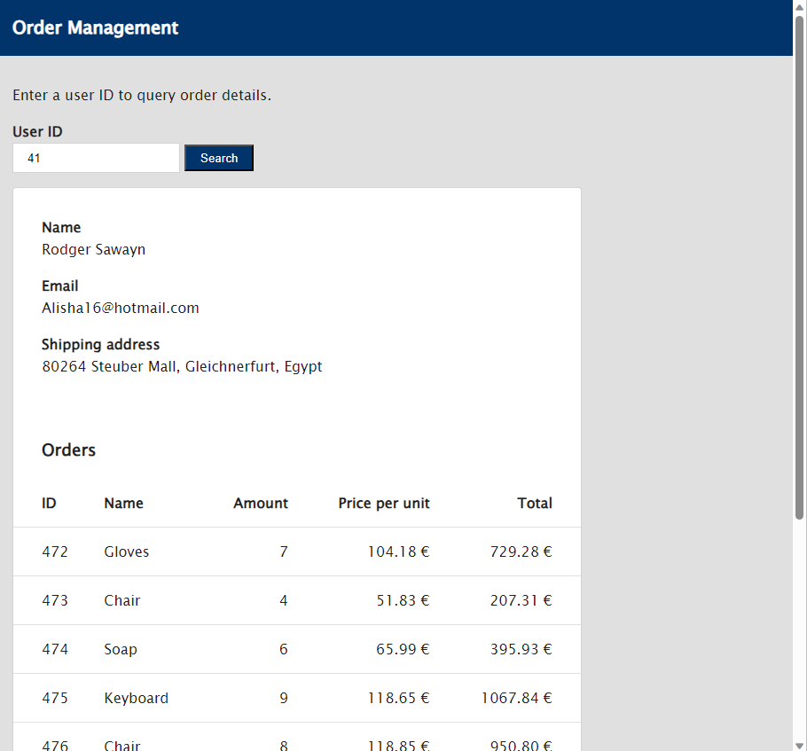

# Krones employment challenge

This directory contains a simple .NET project that serves a static website and a small REST based API using ASP.NET.
Unfortunately, most of the code is lost because someone forgot to push the changes to the remote repository...

The goal of the challenge is to re-implement the missing code in a way that it meets the requirements from the following user story.

---

## User Story

As a Sales Engineer, i would like to see a list every order for a given user, so that i can get an understanding of the things users buy from our shop.

Create a simple website where the user can query a list of orders by entering a user-ID.

### Acceptance criteria

- When opening the website, a form is shown where the user can enter a user-ID.
- The user-ID form accepts only numbers. The user id is a number between 0 and **NumUsers**.
- The site has a "search" button. When clicked, the user information and all orders of the user with the given user-ID are displayed.
- When the user searches for an user id that does not exist, a message is shown that informs her that a user with the given id does not exist.
- After a successful search, the following information are shown
  - First name, last name, email and address of the user with the given id.
  - A list of orders for the given user. For every order, the following information need to be displayed
    - Order id
    - Item name,
    - Amount of items
    - Price per item in euro (2 decimal places)
    - Total price (2 decimal places)

* Clicking the search button after another user id was entered, the data of the new user is shown.
* If an incorrect user id is entered, the data of the previous user needs to be hidden/removed.
* If the orders do not fit on the screen, a scroll-viewer is shown that allows to scroll the page vertically.

### Technical requirements

#### Backend

The data access layer is represented by the `IOrderService` interface. You can use this service to query the total list of orders in the system. The code that generates the orders already exists, but some code got lost. The total number of orders that will be generated needs to be configured in the app settings or via Environment variables. Add back the code the reads the `NumUsers` setting from the configuration.

- Update the OrderService so that the number of users is being read from the app settings.
- Add a rest api that hosts all the endpoints that you need to implement the frontend.
- Use dependency injection for service- and other dependencies of your classes.
- Add logging to your API. Every request to an endpoint should be logged both to the console and to a file.
- Add a Dockerfile that creates a container image for the application.
- Hardcode the `NumUsers` setting to 200 in the Dockerfile.

#### Frontend

The app is already setup to serve `index.html`, `site.js` and `site.css` from the `wwwroot` folder. Implement the frontend by just using vanilla HTML, js and css in those files.

Try to style the application to the following mockup:

